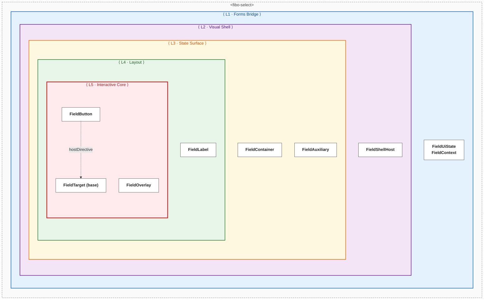

# Form Field Stack — Архітектура директив

Цей документ описує архітектуру field-примітивів у `@fibo-ui/components`: директиви, їх CSS-хуки, data flow і конвенції стилізації.

---

## Для чого взагалі field primitives?

Базова проблема: **shell поля візуально ширший за реальний контрол**.

```
┌─────────────────────────────────────────────┐
│ 🔍  [  input / button / composite div  ]  ✕ │
│     label                                   │
│     hint / error                            │
└─────────────────────────────────────────────┘
  ↑                ↑                       ↑
icon (chrome)  primary control         clear (chrome)
```

Без розподілу ролей одна сутність мала б бути одночасно focusable element, overlay trigger, visual wrapper і aria-label provider — god component. Архітектура розбиває це на директиви з єдиною відповідальністю кожна.

---

## Директиви: повна таблиця

| Клас | Angular selector | CSS клас | Host data-attrs | Host aria-attrs |
|---|---|---|---|---|
| `FieldUiState` | `[fiboFieldUiState]` | — | — | — |
| `FieldShellHost` | `[fiboFieldShellHost]` | — | — | — |
| `FieldContext` | `[fiboFieldContext]` | — | `data-density`, `data-label-layout` | — |
| `FieldContainer` | `[fiboFieldContainer]` | `fibo-field-container` | `data-invalid`, `data-readonly`, `data-pending` | `aria-disabled` |
| `FieldLabel` | `[fiboFieldLabel]` | `fibo-field-label` | — | — |
| `FieldAuxiliary` | `[fiboFieldAuxiliary]` | — | `data-field-auxiliary` | — |
| `FieldTarget` | `[fiboFieldTargetBase]` *(internal, hostDirective-only)* | — | `data-field-target` | `aria-labelledby`, `aria-describedby`, `aria-invalid`, `aria-readonly` |
| `FieldInput` | `[fiboFieldInput]` | `fibo-field-input` | — | (наслідує від FieldTarget base) |
| `FieldButton` | `[fiboFieldButton]` | `fibo-field-button` | — | (наслідує від FieldTarget base) |
| `FieldOverlay` | `[fiboFieldOverlay]` | — | — | `aria-expanded`, `aria-controls` |

Конвенція: директива з власною стилізацією сама додає CSS-клас через `host: { class: '...' }`. Шаблони не ставлять CSS-класи для директив вручну.

---

## DOM структура

```
fibo-field-shell                              ← FieldShell component
  [fiboFieldShellHost]                        ← hostDirective: ID hub, DI bridge
  class="block"

  └── <div [fiboFieldContainer]               ← FieldContainer directive
            class="fibo-field-container"      ←   автоматично від host
            aria-disabled data-invalid …>

        <lucide-icon class="fibo-field-icon shrink-0">   ← icon start

        <div class="fibo-field-body">
          <label [fiboFieldLabel]              ← FieldLabel directive
                 class="fibo-field-label">    ←   автоматично від host
          </label>

          <div class="fibo-field-content">
            <ng-content>                      ← Primary control:
              input[fiboFieldInput]            ←   FieldInput: id, aria-*, class="fibo-field-input"
              button[fiboFieldButton           ←   (Select) — FieldButton: tabindex, keyboard activation
                     fiboFieldOverlay]         ←   FieldOverlay: open/close, aria-expanded
              div[fiboFieldButton              ←   (MultiSelect) — composite activation-surface
                  fiboFieldOverlay]
            </ng-content>
          </div>
        </div>

        <button [fiboFieldAuxiliary]           ← FieldAuxiliary directive
                class="fibo-field-clear">     ←   клас у шаблоні FieldShell (виняток)
        </button>

        <lucide-icon class="fibo-field-icon fibo-field-icon-end">   ← icon end

  └── <div class="fibo-field-error">          ← помилка під полем
  └── <div class="fibo-field-hint">           ← hint під полем
```

`FieldContext` ставиться на зовнішньому обгортці споживача. Його `data-density` / `data-label-layout` каскадуються CSS descendant selectors всередину `.fibo-field-container`:
```css
[data-density="compact"] .fibo-field-container { --ff-control-min-height: 2rem; }
[data-label-layout="inline"] .fibo-field-container { --ff-body-direction: row; }
```

---

## Ієрархія директив на прикладі `Select`

Select — один компонент, який архітектурно складається з п'яти шарів. Рух **зовні всередину**: від зовнішнього Forms-контракту до інтерактивного ядра. Кожен шар — одна відповідальність; директиви в шарі забезпечують саме її.



### Що робить кожен шар

| Шар | Відповідальність | Директиви |
|---|---|---|
| **L1 · Forms Bridge** | міст між Angular Signal Forms і UI; прийом зовнішніх налаштувань density / layout | `FieldUiState`, `FieldContext` |
| **L2 · Visual Shell** | візуальний chrome: label, ікони, кнопка clear, hint/error; DI-хаб для ID і ref-реєстрацій | `FieldShellHost` |
| **L3 · State Surface** | `aria-disabled`, `data-invalid/readonly/pending` на обгортці; click-делегація на primary target; скіп `FieldAuxiliary` | `FieldContainer`, `FieldAuxiliary` |
| **L4 · Layout** | стос label ↔ control (stacked/inline), hint/error placement; `for` / `id` wiring | `FieldLabel` |
| **L5 · Interactive Core** | справжня точка взаємодії: focus/activation surface, ARIA-контракт, overlay lifecycle | `FieldButton`, `FieldTarget (base)`, `FieldOverlay` |

### Як читати

- **Зовні → всередину.** L1 — що споживач бачить як публічну API Select. L5 — де реально відбувається взаємодія з користувачем. Кожен внутрішній шар робить свою частину того, що ззовні виглядає як цілісний компонент.
- **Відповідальність не перетікає між шарами.** L3 нічого не знає про overlay чи focus; L5 нічого не знає про label чи layout. Це робить композицію передбачуваною й дозволяє замінити будь-який шар окремо.
- **`FieldAuxiliary` — на рівні L3 поряд з `FieldContainer`.** Він живе на state-поверхні бо відповідає за click-делегацію в межах контейнера, а не за primary interaction (тому не в L5).
- **Пунктир `hostDirective`** між `FieldButton` і `FieldTarget (base)` — композиція директив на одному елементі, не DOM-вкладення. `FieldButton` застосовує `FieldTarget` через `hostDirectives: [FieldTarget]`.

---

### Варіації за споживачами

Шари L1–L4 **однакові для всіх** FormField-споживачів. Змінюється тільки **L5 · Interactive Core** — конкретний target-елемент і директива на ньому:

| Споживач | L5 Interactive Core | Overlay? | Aux (clear) |
|---|---|---|---|
| `TextField` | `<input fiboFieldInput>` | — | ✅ |
| `DatePickerField` | `<input fiboFieldInput>` + `[fiboFieldOverlay]` | ✅ (auto-open) | ✅ |
| `Select` *(ця діаграма)* | `<button fiboFieldButton>` + `[fiboFieldOverlay]` | ✅ | — |
| `MultiSelect` | `<div fiboFieldButton>` + `[fiboFieldOverlay]` | ✅ | chip-remove |
| `Combobox` | `<input fiboFieldInput>` + власний overlay | ✅ | ✅ |

Щоб отримати діаграму для будь-якого іншого споживача — замініть вміст L5 на відповідну директиву з цієї таблиці. Верхні чотири шари залишаються ідентичними.

---

## Конвенція стилізації

Єдиний патерн: директива сама несе CSS-ідентифікатор через `host: { class }`.

```ts
// Button
host: { class: 'fibo-btn' }
// → CSS: .fibo-btn[data-appearance="primary"] { ... }

// FieldContainer
host: { class: 'fibo-field-container' }
// → CSS: .fibo-field-container[data-invalid] { ... }

// FieldLabel
host: { class: 'fibo-field-label' }
// → CSS: .fibo-field-container:focus-within .fibo-field-label { ... }
```

**`FieldAuxiliary` — виняток**: директива ставить тільки `data-field-auxiliary` (behavioral marker для click delegation). Клас `fibo-field-clear` — стиль конкретної кнопки очищення — залишається в шаблоні `FieldShell`. Об'єднувати не має сенсу, бо це різні відповідальності.

---

## Data Flow

```
Angular Signal Forms FieldTree
  │
  │  ([formField] прив'язує FieldState → inputs директиви)
  ▼
FieldUiState  (hostDirective на компоненті)
  │
  │  inject(FieldUiState, { optional: true })
  ▼
FieldContainer [fiboFieldContainer]
  │  читає: disabled, readonly, pending, invalid, touched
  │  ставить: aria-disabled, data-invalid, data-readonly, data-pending
  ▼
FieldInput/FieldButton [fiboFieldTargetBase]
  │  inject(FieldShellHost) → ID система
  │  inject(FieldUiState)   → describedBy логіка
  ▼
  auto-wires: id, aria-labelledby, aria-describedby, aria-invalid, aria-readonly
```

---

## Примітиви: детальний опис

### `FieldUiState` (`[fiboFieldUiState]`)

Bridge між Angular Signal Forms і візуальним шаром. Використовується як `hostDirectives` на кожному field-компоненті.

**Inputs** (16 штук): `disabled`, `disabledReasons`, `readonly`, `hidden`, `invalid`, `pending`, `touched` (model — бо UI може мутувати), `dirty`, `name`, `required`, `min`, `minLength`, `max`, `maxLength`, `pattern`, `errors`.

**Derived**: `errorMessage` — computed: перший `errors[0].message` якщо `invalid && touched`.

---

### `FieldShellHost` (`[fiboFieldShellHost]`)

DI-хаб і провайдер ID системи. `hostDirective` на `FieldShell`.

- Зберігає ref до `FieldContainer` елемента і `FieldTarget`
- Генерує `idFor(suffix)` → `field-N-label`, `field-N-control`, `field-N-error`, `field-N-hint`
- Методи: `activatePrimary()`, `focusReturnTarget()`, `referenceElement()`

---

### `FieldShell` (`fibo-field-shell`)

Візуальний контейнер — "chrome" навколо реального контролу.

**Inputs**: `label`, `hint`, `iconStart`, `iconEnd`, `canClear`.
**Output**: `clearRequested`.

---

### `FieldContainer` (`[fiboFieldContainer]`)

Ставить aria/data стани на wrapper div. Делегує кліки через `FieldShellHost.activatePrimary()`.

```
клік на контейнер?
  └─ target.closest('button,input,select,a,label,[data-field-target],[data-field-auxiliary]')?
       ├─ ТАК → браузер обробить сам
       └─ НІ → host.activatePrimary()
```

---

### `FieldLabel` (`[fiboFieldLabel]`)

Маркує `<label>`. Автоматично прив'язує `id` і `for` через `FieldShellHost`. Сповіщає `FieldShellHost.setHasLabel(true)` — `FieldTarget` використовує це для `aria-labelledby`.

---

### `FieldAuxiliary` (`[fiboFieldAuxiliary]`)

Маркер secondary action (`data-field-auxiliary="true"`). `FieldContainer` і `FieldOverlay` перевіряють цей атрибут при обробці кліків і пропускають без перехоплення.

---

### `FieldTarget` (base, `[fiboFieldTargetBase]` — internal)

Infrastructure база для primary interactive targets. Hostdirective-only — користувачі не пишуть селектор вручну.

**Відповідальність**:
- Генерує `id` через `FieldShellHost.idFor('control')`.
- Ставить `aria-labelledby` / `aria-describedby` / `aria-invalid` / `aria-readonly` на host.
- Ставить `data-field-target="true"` для click-delegation у `FieldContainer`.
- Експонує `element()` getter.

**НЕ реєструється** у `FieldShellHost` — це робить реалізатор (`FieldInput` або `FieldButton`).

---

### `FieldInput` (`[fiboFieldInput]`)

Primary target для `<input>` / `<textarea>`. Focus-surface контракт.

**Що робить**:
- Ставить `class="fibo-field-input"` на host (замість ручного class у шаблоні).
- Реєструє себе в `FieldShellHost` як `FieldTargetRef`.
- Інжектить `FieldOverlay` з `{ self: true }` — якщо поруч є overlay, `activateFromShell()` відкриває його.

**Shell click behavior**:
- Без overlay — `focus()`.
- З overlay на тому ж елементі (DatePicker) — `focus() + overlay.open()`.
- Click всередині input тексту — native browser caret placement, overlay не тригериться.

---

### `FieldButton` (`[fiboFieldButton]`)

Primary target для `<button>` / `<div>` / `<a>`. Activation-surface контракт.

**Що робить**:
- Ставить `class="fibo-field-button"` на host (invisible focus, inherits alignment).
- Керує `tabindex` — `0` або `-1` за `disabled`.
- Мапить `keydown.enter` / `keydown.space` на `element.click()` для не-button хостів (native button обробляє сам).
- Реєструє себе в `FieldShellHost` як `FieldTargetRef`.

**Shell click behavior**:
- `activateFromShell()` → `focus() + element.click()` → `FieldOverlay.onHostClick` детектить `FieldButton` → `toggle()`.

---

### `FieldContext` (`[fiboFieldContext]`)

Ставиться на зовнішньому контейнері. Контролює density і label-layout.

```html
<form [fiboFieldContext] density="compact" labelLayout="inline">
  <fibo-text-field ... />
  <fibo-select ... />
</form>
```

---

### `FieldOverlay` (`[fiboFieldOverlay]`)

Управляє lifecycle overlay (Select, DatePicker). Потребує `FieldButton` або `FieldInput` на тому ж елементі.

```html
<button fiboFieldButton [fiboFieldOverlay]="dropdownTpl">
```

`open()`/`toggle()` перевіряють `disabled`/`readonly` перед відкриттям.

---

## Споживачі

| Компонент | FieldUiState | FieldShell | Target | Overlay | FieldAuxiliary |
|---|---|---|---|---|---|
| `TextField` | hostDirective | ✅ | `<input fiboFieldInput>` | — | — |
| `DatePickerField` | hostDirective | ✅ | `<input fiboFieldInput>` | ✅ (auto-open на shell click) | — |
| `Select` | hostDirective | ✅ | `<button fiboFieldButton>` | ✅ | — |
| `MultiSelect` | hostDirective | ✅ | `<div fiboFieldButton>` | ✅ | chip-remove |
| `Combobox` | hostDirective | ✅ | `<input fiboFieldInput>` | ✅ (власний createOverlay) | — |
| `Checkbox` | власні inputs | — | — | — | — |
| `Switch` | власні inputs | — | — | — | — |

---

## Куди рухатись далі

### 1. CSS tokens: закрити gap між theme.css і form-field.css

В `theme.css` є `--fibo-field-bg`, `--fibo-field-text`, `--fibo-field-outline` та ін. Але `form-field.css` зараз **не використовує** більшість з них — хардкодить значення безпосередньо в CSS правилах. Єдиний token що підключений — `--fibo-field-placeholder`.

Наступний крок: підключити решту tokens, як це вже зроблено в `button.css` через `--btn-bg`, `--btn-text` тощо. Тоді dark mode оверрайди теж підуть через tokens, а не через дублювання selectors.

### 2. Content projection для іконок

`iconStart` / `iconEnd` зараз є string inputs → Lucide icon name. Це жорстке обмеження: не можна передати кастомну SVG або компонент.

Розглянути перехід на content projection через `@ContentChild` з маркерами `[fiboFieldIconStart]` / `[fiboFieldIconEnd]` — за аналогією з `MatPrefix`/`MatSuffix` у Angular Material. `FieldShell` залишається backward-compatible через збереження string inputs як fallback.
