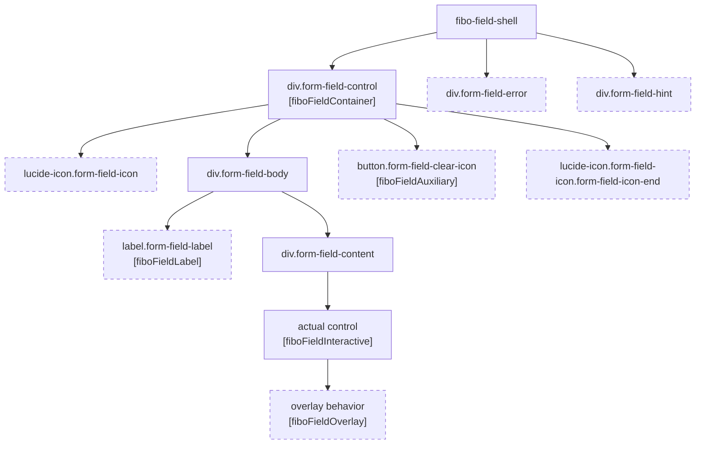

# Styling Refactor Plan

## Мета

Це робочий документ для рефакторингу style system у `fibo-ui`.

Його задача:

- фіксувати, **що вже зроблено**;
- фіксувати, **що робимо далі**;
- тримати послідовність рефакторингу, щоб не втратити архітектурне рішення;
- почати рефакторинг з `FormField` як базового styling primitive.

Це не фінальна архітектурна специфікація. Це **progress document**, який будемо поповнювати по мірі роботи.

Пов’язані документи:

- [docs/philosophy.md](./philosophy.md)
- [docs/styling-system.md](./styling-system.md)
- [docs/taiga-ui-v5-styling-report.md](./taiga-ui-v5-styling-report.md)

---

## Поточний статус

### Уже зроблено

1. Описана загальна архітектура style system у [docs/styling-system.md](./styling-system.md).
2. Зафіксовано цільове рішення:
   - native CSS only;
   - global theme + global component rules;
   - `appearance` і `size` як спільні осі;
   - `data-appearance`, `data-size`, `data-invalid`, `data-pending`, `data-readonly`, `aria-disabled`;
   - без `data-variant`;
   - без Less/SCSS;
   - без імпорту стилів із Angular-компонентів.
3. Окремо розібрано референс `Taiga UI v5` у [docs/taiga-ui-v5-styling-report.md](./taiga-ui-v5-styling-report.md).
4. Зафіксовано, що `data-state` поки **не вводимо як загальний контракт**, можливо повернемось до нього пізніше для popup / trigger use cases.
5. Проведено первинний аудит поточного `FormField` і зафіксовано його реальну DOM-структуру та директиви.
6. ✅ **Завершено повний рефакторинг FormField + всіх field-like споживачів** (2026-04-15):

   **Directive contract:**
   - `FormUiState` → `FieldUiState`, константа `FIELD_UI_STATE_INPUTS`
   - `FieldInteractiveDirective` → `FieldTarget`, selector `[fiboFieldTarget]`, input `fieldTargetMode`
   - Всі `*Directive` суфікси видалено: `FieldAuxiliary`, `FieldContainer`, `FieldLabel`, `FieldOverlay`, `FieldShellHost`
   - Інтерфейс `FieldInteractiveRef` → `FieldTargetRef`
   - Нова директива `FieldContext` (`[fiboFieldContext]`) — `density` + `labelLayout` через `data-density` / `data-label-layout`

   **Data attributes:**
   - `data-error` → `data-invalid`
   - `data-can-clear` → `data-has-clear`
   - `data-field-interactive` → `data-field-target`

   **CSS класи:**
   - `form-field-clear-icon` → `form-field-clear`
   - `text-field-input` → `form-field-input`
   - typo `from-field-placeholder` → `form-field-placeholder`
   - Flat namespace `.form-field-*` без brand prefix — остаточне рішення

   **CSS structure + @layer:**
   - `form-fields.css` видалено
   - `components.css` видалено (`.fibo-input` не використовувався ніде)
   - Нова структура в `styles/`: `appearance.css`, `form-field.css`, `datalist.css`, `overlay.css`
   - Каскадні шари: `@layer theme, base, appearance, field-rules, components, utilities`
   - `.ff-density-compact` / `.ff-label-inline` / `.ff-filter-bar` / `.ff-rounded` → замінено на `FieldContext` і `.form-field-filter-bar` / `.form-field-rounded`
   - `ng-package.json` assets: `src/styles/**` (автоматично підхоплює нові файли)

   **Споживачі оновлені:** `TextField`, `Select`, `MultiSelect`, `DatePickerField`, `Combobox`

7. ✅ **Завершено рефакторинг Checkbox + Switch** (2026-04-15):

   - Шаблони переписані з Tailwind peer-селекторів на семантичні класи (`checkbox-box`, `switch-track`, `switch-thumb`)
   - TypeScript: видалено computed сигнали `trackSize`, `thumbSize`, `checkedTranslate` зі Switch — розміри тепер у CSS
   - Host bindings: `data-checked`, `data-indeterminate`, `data-size`, `data-loading` — для CSS styling
   - `aria-disabled`, `aria-readonly` — для native states (консистентно з `FieldContainer`)
   - `styles/checkbox.css` — state через `fibo-checkbox[data-checked]`, focus-visible через `:has()`
   - `styles/switch.css` — розміри через CSS variables per `data-size`, thumb через `transform` + CSS var

8. ✅ **Нормалізація aria-*/data-* contract** (2026-04-15):
   - Правило зафіксовано: native states (`disabled`, `readonly`) → `aria-*`; domain/visual states → `data-*`
   - Видалено `aria-required` з `FieldContainer` — він зайвий, бо `required` вже на `<input>` в `FieldTarget`
   - Видалено computed `required` з `FieldContainer`

9. `ng build` проходить чисто після всіх змін.

---

## State attribute contract (фінальний)

### На field container (`.form-field-control`)

| Атрибут | Тип | Джерело |
|---|---|---|
| `aria-disabled` | native state | `FieldContainer` |
| `data-invalid` | domain state | `FieldContainer` (invalid && touched) |
| `data-pending` | domain state | `FieldContainer` |
| `data-readonly` | domain state | `FieldContainer` |
| `data-has-clear` | visual state | `FieldShell` template |
| `data-density` | layout context | `FieldContext` |
| `data-label-layout` | layout context | `FieldContext` |

### На interactive element (`FieldTarget`)

| Атрибут | Тип |
|---|---|
| `data-field-target` | technical marker |
| `aria-labelledby` | a11y |
| `aria-describedby` | a11y |
| `aria-invalid` | a11y |
| `aria-readonly` | a11y |
| `aria-expanded` / `aria-controls` | a11y (overlay triggers) |

### На Checkbox / Switch host

| Атрибут | Тип |
|---|---|
| `data-checked` | visual state (aria-checked не можна без role) |
| `data-indeterminate` | visual state |
| `aria-disabled` | native state |
| `aria-readonly` | native state (Checkbox) |
| `data-size` | visual scale (Switch) |
| `data-loading` | visual state (Switch) |

---

## Поточна черга

- [ ] **`Appearance` + `Size` директиви** — cross-component styling axes, розташування: `lib/primitives/`. Мінімальний API: `[fiboAppearance]` → `data-appearance` на host; `[fiboSize]` → `data-size` на host. Перші споживачі: `Button`, `Listbox item`, `Popover surface`.
- [ ] **Button** — переписати `buttons.css` з `@apply` на native CSS, ввести `Appearance` + `Size` осі *(окрема задача, після директив)*
- [ ] **Публічний theming contract** — зафіксувати які `--ff-*` і `--form-field-*` CSS variables є публічним API бібліотеки

### Поточна точка входу

Перший рефакторинг починаємо з:

- `FormField`

Причина:

- це один із головних visual primitives у бібліотеці;
- через нього проходять `TextField`, `Select`, `DatePickerField`, `Combobox` та інші field-like компоненти;
- якщо привести `FormField` до нового CSS contract, далі інші form controls буде значно простіше переводити на нову систему.

---

## Принцип старту

Рефакторинг не починаємо зі "зміни кольорів" чи "переносу всіх стилів одразу".

Починаємо з такого порядку:

1. зафіксувати **target DOM/CSS contract** `FormField`;
2. зафіксувати **набір state/data attributes**;
3. розділити:
   - layout shell,
   - appearance,
   - state rules;
4. лише після цього переносити стилі у глобальні CSS-шари.

---

## Що саме починаємо з `FormField`

### Ціль для першого етапу

Отримати `FormField` у вигляді стабільного styling primitive з такими властивостями:

- зрозумілий root selector;
- зрозумілі semantic slots;
- мінімальний і стабільний набір `data-*` / `aria-*`;
- глобальні CSS rules;
- відсутність utility-soup у шаблоні;
- готовність для підключення спільних `appearance` і `size` директив.

---

## Поточний `FormField` as-is

Нижче зафіксована **поточна реальна структура**, взята з коду, а не з припущень.

### Ключові файли

- [field-shell.ts](/Users/dentiman/dev/projects/fibo-stack/fibo-ui/projects/fibo-ui/components/src/lib/form-controls/form/field-shell.ts)
- [field-shell-host.ts](/Users/dentiman/dev/projects/fibo-stack/fibo-ui/projects/fibo-ui/components/src/lib/form-controls/form/field-shell-host.ts)
- [field-container.ts](/Users/dentiman/dev/projects/fibo-stack/fibo-ui/projects/fibo-ui/components/src/lib/form-controls/form/field-container.ts)
- [field-label.ts](/Users/dentiman/dev/projects/fibo-stack/fibo-ui/projects/fibo-ui/components/src/lib/form-controls/form/field-label.ts)
- [field-interactive.ts](/Users/dentiman/dev/projects/fibo-stack/fibo-ui/projects/fibo-ui/components/src/lib/form-controls/form/field-interactive.ts)
- [field-auxiliary.ts](/Users/dentiman/dev/projects/fibo-stack/fibo-ui/projects/fibo-ui/components/src/lib/form-controls/form/field-auxiliary.ts)
- [field-overlay.ts](/Users/dentiman/dev/projects/fibo-stack/fibo-ui/projects/fibo-ui/components/src/lib/form-controls/form/field-overlay.ts)
- [form-ui-state.ts](/Users/dentiman/dev/projects/fibo-stack/fibo-ui/projects/fibo-ui/components/src/lib/form-controls/form/form-ui-state.ts)

### Реальні примітиви

На сьогодні `FormField` складається не з абстрактних "slot ideas", а з конкретних примітивів:

- `FieldShell`
- `FieldShellHostDirective`
- `FieldContainerDirective`
- `FieldLabelDirective`
- `FieldInteractiveDirective`
- `FieldAuxiliaryDirective`
- `FieldOverlayDirective`
- `FormUiState`

### Важливе уточнення

У поточному коді:

- **`body` існує** як DOM-елемент з класом `.form-field-body`;
- **`content` існує** як DOM-елемент з класом `.form-field-content`;
- **`actiontarget` не існує** як окрема сутність або директива;
- роль вторинної дії зараз реалізована через:
  - директиву `fiboFieldAuxiliary`
  - атрибут `data-field-auxiliary="true"`

Тобто для подальшого рефакторингу ми маємо опиратись саме на ці реальні елементи, а не вигадувати нові назви до фіксації контракту.

---

## Поточна DOM-ієрархія `FieldShell`

Поточний шаблон `FieldShell` рендерить таку структуру:

```html
<fibo-field-shell>
  <div fiboFieldContainer class="form-field-control" data-can-clear>
    <lucide-icon class="form-field-icon"></lucide-icon>?

    <div class="form-field-body">
      <label fiboFieldLabel class="form-field-label"></label>?

      <div class="form-field-content">
        <ng-content />
      </div>
    </div>

    <button
      fiboFieldAuxiliary
      class="form-field-clear-icon"
      data-field-auxiliary="true"
    ></button>?

    <lucide-icon class="form-field-icon form-field-icon-end"></lucide-icon>?
  </div>

  <div class="form-field-error" id="..."></div>?
  <div class="form-field-hint" id="..."></div>?
</fibo-field-shell>
```

### Реальні slot-рівні в DOM

На поточний момент можна зафіксувати такі реальні DOM-рівні:

1. **Shell root**
   `fibo-field-shell`

2. **Control container**
   `.form-field-control` + `fiboFieldContainer`

3. **Start chrome**
   `.form-field-icon`

4. **Body**
   `.form-field-body`

5. **Label**
   `.form-field-label` + `fiboFieldLabel`

6. **Primary content slot**
   `.form-field-content`
   Усередині нього рендериться actual control через `<ng-content>`

7. **Auxiliary action**
   `.form-field-clear-icon` + `fiboFieldAuxiliary`

8. **End chrome**
   `.form-field-icon.form-field-icon-end`

9. **Supporting text**
   `.form-field-error` або `.form-field-hint`

---

## Схематична діаграма поточного DOM



Спрощено:

```text
fibo-field-shell
├─ .form-field-control [fiboFieldContainer]
│  ├─ .form-field-icon (start)?
│  ├─ .form-field-body
│  │  ├─ .form-field-label [fiboFieldLabel]?
│  │  └─ .form-field-content
│  │     └─ actual control [fiboFieldInteractive] (+ [fiboFieldOverlay] опціонально)
│  ├─ .form-field-clear-icon [fiboFieldAuxiliary]?
│  └─ .form-field-icon.form-field-icon-end?
├─ .form-field-error?
└─ .form-field-hint?
```

---

## Поточний contract директив

### `FieldShellHostDirective`

Що робить:

- генерує base id `field-N`;
- вміє будувати `idFor(...)`;
- реєструє:
  - container element
  - interactive element
  - факт наявності label
- дає API для:
  - `referenceElement()`
  - `focusReturnTarget()`
  - `activatePrimary()`

Смисл:

- це внутрішній coordination layer між shell, label, interactive і overlay.

### `FieldContainerDirective`

Вішається на `.form-field-control`.

Поточні host attributes / behavior:

- `aria-disabled`
- `aria-required`
- `data-error`
- `data-readonly`
- `data-pending`
- `class.disabled`
- `(click)` → click delegation до primary interactive

Також:

- реєструє container element у `FieldShellHostDirective`.

### `FieldLabelDirective`

Вішається на `.form-field-label`.

Поточні host bindings:

- `id`
- `for`

Також:

- каже `FieldShellHostDirective`, що label існує.

### `FieldInteractiveDirective`

Вішається на actual control всередині `.form-field-content`.

Поточні host bindings:

- `data-field-interactive="true"`
- `id`
- `aria-labelledby`
- `aria-describedby`
- `aria-invalid`
- `aria-readonly`

Поточний input:

- `fieldInteractiveMode = 'focus' | 'click'`

Смисл:

- це primary target у межах shell;
- саме до нього делегується focus / click із container.

### `FieldAuxiliaryDirective`

Вішається на secondary action елемент.

Поточний host attribute:

- `data-field-auxiliary="true"`

Смисл:

- контейнер не повинен перехоплювати клік по цьому елементу;
- зараз це використовується для clear button.

### `FieldOverlayDirective`

Вішається на той самий interactive element, який є trigger.

Поточні host bindings:

- `aria-expanded`
- `aria-controls`
- `(click)` → toggle, якщо `fieldInteractiveMode === 'click'`

Смисл:

- overlay зараз не вводить окремий DOM-slot у shell;
- він використовує вже існуючий interactive target як popup trigger.

---

## Поточний набір класів `FormField`

На сьогодні реально існують такі CSS-класи:

- `.form-field-control`
- `.form-field-body`
- `.form-field-label`
- `.form-field-content`
- `.form-field-icon`
- `.form-field-icon-end`
- `.form-field-clear-icon`
- `.form-field-error`
- `.form-field-hint`

### Додаткові пов’язані класи поза shell

Ці класи не є частиною shell wrapper, але функціонально належать до field ecosystem:

- `.text-field-input`
- `.from-field-placeholder` ← **опечатка**

Окремо в загальних стилях також використовуються пов’язані класи:

- `.form-field-control`
- `.form-field-body`
- `.form-field-content`
- `.text-field-input`
- `.form-field-icon`

---

## Поточна стилізація `FormField`: appearance vs color scheme

### Що є зараз у `fibo-ui`

Поточна стилізація `FormField` у [form-fields.css](/Users/dentiman/dev/projects/fibo-stack/fibo-ui/projects/fibo-ui/components/src/form-fields.css:1) побудована не через публічні appearance-варіанти типу `primary` / `secondary`, а через:

- один базовий visual mode для `.form-field-control`;
- state-правила:
  - `[data-error]`
  - `[data-pending]`
  - `[data-readonly]`
  - `[aria-disabled="true"]`
- layout/context modifiers:
  - `.ff-rounded`
  - `.ff-label-inline`
  - `.ff-density-compact`
  - `.ff-filter-bar`

Тобто зараз у `FormField` є:

- **base field shell**
- **state styling**
- **layout/density modifiers**

Але немає окремої semantic appearance-осі на кшталт:

- `primary`
- `secondary`
- `danger`
- `ghost`

### Звідки зараз береться колір

Колірна схема поля зараз іде через theme tokens у [theme.css](/Users/dentiman/dev/projects/fibo-stack/fibo-ui/projects/fibo-ui/components/src/theme.css:86):

- `--form-field-bg`
- `--form-field-text`
- `--form-field-outline`
- `--form-field-outline-focus`
- `--form-field-bg-error`
- `--form-field-outline-error`
- `--form-field-bg-disabled`
- `--form-field-text-disabled`
- `--form-field-outline-disabled`
- `--form-field-label-text`
- `--form-field-label-text-focus`
- `--form-field-label-text-error`
- `--form-field-label-text-disabled`
- `--form-field-placeholder`

На практиці це означає:

- у поля є одна canonical color scheme;
- є окремі light / dark значення токенів;
- але немає набору field-specific schemes типу `secondary field`, `accent field`, `danger field`.

### Що зараз означає `secondary`

Слово `secondary` у репозиторії зараз відноситься не до `FormField`, а до інших шарів:

- до кнопок:
  - `.btn-secondary` у [buttons.css](/Users/dentiman/dev/projects/fibo-stack/fibo-ui/projects/fibo-ui/components/src/buttons.css:29)
- до загальних theme tokens:
  - `--background-secondary`
  - `--foreground-secondary`

Тобто на поточний момент:

- `secondary` = не контракт `FormField`;
- `secondary` = скоріше рівень поверхні / тексту / кнопки;
- переносити цей термін у поле без окремої моделі не варто.

### Як це роблять у інших бібліотеках

#### Taiga UI v5

У Taiga `textfield` має свій окремий appearance за замовчуванням:

- [textfield.options.ts](/Users/dentiman/dev/projects/fibo-stack/taiga-ui-5/projects/core/components/textfield/textfield.options.ts:12)
- default: `appearance: 'textfield'`

І сам CSS appearance для поля винесений окремо:

- [textfield.less](/Users/dentiman/dev/projects/fibo-stack/taiga-ui-5/projects/styles/theme/appearance/textfield.less:3)

Важлива різниця:

- `textfield` у Taiga — це окремий field appearance;
- `primary`, `secondary`, `flat`, `outline`, `neutral`, `warning` тощо — це загальний appearance vocabulary для різних компонентів, особливо кнопок і surface-like елементів;
- тобто Taiga не змішує textfield shell з button semantics.

#### Angular Material

У Material є явне розділення між:

- `appearance = 'fill' | 'outline'`
- `color = 'primary' | 'accent' | 'warn'`

Джерело:

- [form-field.ts](/Users/dentiman/dev/projects/fibo-stack/components/src/material/form-field/form-field.ts:64)

Тобто у Material:

- `appearance` відповідає за форму контейнера;
- `color` відповідає за тематичний акцент;
- ці осі не злиті в одну.

#### Spartan / Zard

У `Spartan` і `Zard` базові input/input-like примітиви здебільшого мають один canonical shell style:

- [hlm-input.ts](/Users/dentiman/dev/projects/fibo-stack/spartan/libs/helm/input/src/lib/hlm-input.ts:1)
- [input.directive.ts](/Users/dentiman/dev/projects/fibo-stack/zart/libs/zard/src/lib/shared/components/input/input.directive.ts:1)

Для них характерно:

- один базовий input style;
- окремі state rules для error / disabled / focus;
- багаті `variant` / `type` vocabulary більше притаманні buttons, badges, toggles, dropdowns, але не plain text inputs.

### Висновок для `FormField`

Для першого етапу рефакторингу не варто вводити для `FormField` публічні значення на кшталт:

- `appearance="primary"`
- `appearance="secondary"`

Краще зафіксувати таку модель:

- у `FormField` є один canonical base appearance;
- color scheme поки йде через theme tokens;
- state styling живе окремо;
- layout/density живуть окремо;
- якщо пізніше з’явиться реальна потреба у другій field scheme, її треба вводити або:
  - як окремий field-specific appearance;
  - або як окрему вісь scheme/tone;
  - але не через пряме копіювання button vocabulary.

### Робоче рішення на поточний етап

У межах першого рефакторингу фіксуємо:

- `FormField` **не має** appearance `secondary`;
- `FormField` **не має** appearance `primary`;
- `FormField` поки має один стабільний shell style;
- усі альтернативи кольору поки вирішуються через tokens / theme / context;
- питання другої color scheme для field відкладаємо як окреме design decision після стандартизації базового контракту.

---

## Карта поточних імен та пропозиція нормалізації

Нижче не фінальне перейменування, а стартова map для обговорення.

| Поточне ім’я | Роль | Проблема | Пропозиція |
|---|---|---|---|
| `.form-field-control` | головний visual container | нормальне legacy ім’я, але без `fibo-` namespace | `.fibo-form-field__control` |
| `.form-field-body` | внутрішній layout wrapper | реально існує, ок по змісту | `.fibo-form-field__body` |
| `.form-field-content` | slot для actual control | реально існує, ок по змісту | `.fibo-form-field__content` |
| `.form-field-label` | label slot | нормальне | `.fibo-form-field__label` |
| `.form-field-icon` | icon slot | занадто generic для довгострокового contract | `.fibo-form-field__icon` |
| `.form-field-icon-end` | end icon modifier | modifier є, але naming не BEM-like | `.fibo-form-field__icon--end` |
| `.form-field-clear-icon` | clear action slot | на поточному етапі це свідомо конкретний slot для clear action | поки залишити як `form-field-clear-icon` |
| `.form-field-error` | supporting error text | нормальне | `.fibo-form-field__error` |
| `.form-field-hint` | supporting hint text | нормальне | `.fibo-form-field__hint` |
| `.from-field-placeholder` | placeholder text для select/multi-select | **опечатка** + неузгоджене ім’я | `.fibo-form-field__placeholder` |
| `.text-field-input` | actual text-like control | скоріше control-level class, а не shell slot | поки залишити окремо від shell map |

### Попередня map `current -> target`

```text
form-field-control      -> fibo-form-field__control
form-field-body         -> fibo-form-field__body
form-field-content      -> fibo-form-field__content
form-field-label        -> fibo-form-field__label
form-field-icon         -> fibo-form-field__icon
form-field-icon-end     -> fibo-form-field__icon--end
form-field-error        -> fibo-form-field__error
form-field-hint         -> fibo-form-field__hint
from-field-placeholder  -> fibo-form-field__placeholder
```

### Стратегія перейменування

Найменш ризикований шлях:

1. ввести нові standardized classes паралельно зі старими;
2. тимчасово підтримувати old + new selectors;
3. перевести consumer templates;
4. видалити legacy names після переходу.

Тобто не робити великий rename одним ударом.

---

## Явно зафіксовані проблеми в поточних іменах

### 1. Опечатка `from-field-placeholder`

Знайдено в:

- [components.css](/Users/dentiman/dev/projects/fibo-stack/fibo-ui/projects/fibo-ui/components/src/components.css:7)
- [select.ts](/Users/dentiman/dev/projects/fibo-stack/fibo-ui/projects/fibo-ui/components/src/lib/form-controls/select/select.ts:62)
- [multi-select.ts](/Users/dentiman/dev/projects/fibo-stack/fibo-ui/projects/fibo-ui/components/src/lib/form-controls/select/multi-select.ts:79)

Проблема:

- це typo;
- така назва не повинна переходити в стандартизований contract.

Пропозиція:

- short-term: прибрати typo;
- target name: `.fibo-form-field__placeholder`

### 2. `clear-icon` поки залишається canonical slot name

На поточному етапі **не** узагальнюємо `form-field-clear-icon` у `auxiliary`.

Причина:

- зараз це справді центральний і стабільний slot для очищення `FormField`;
- інших action-slot сценаріїв у shell ще немає;
- передчасне узагальнення тільки погіршить читабельність.

Тому фіксуємо:

- `form-field-clear-icon` лишається як canonical name на цей етап;
- `fiboFieldAuxiliary` лишається технічною директивою-маркером для click-delegation behavior;
- якщо пізніше з’являться інші secondary actions, тоді окремо повернемось до узагальнення slot model.

### 3. Частина назв structural, частина semantic, частина implementation-specific

Зараз змішані різні рівні:

- structural:
  - `body`
  - `content`
- semantic:
  - `label`
  - `error`
  - `hint`
- implementation-specific:
  - `clear-icon`

Це не критична помилка, але саме тут потрібна стандартизація naming contract.

---

## Поточний набір data/aria атрибутів

### На container (`.form-field-control`)

Поточний стан:

- `aria-disabled`
- `aria-required`
- `data-error`
- `data-readonly`
- `data-pending`
- `data-can-clear`

### На interactive element

Поточний стан:

- `data-field-interactive`
- `id`
- `aria-labelledby`
- `aria-describedby`
- `aria-invalid`
- `aria-readonly`

Для overlay-trigger сценаріїв додатково:

- `aria-expanded`
- `aria-controls`

### На auxiliary element

Поточний стан:

- `data-field-auxiliary`

---

## План стандартизації state attributes

Окремий напрямок рефакторингу — привести `data-*` і `aria-*` до одного стандарту по всій style system.

### Проблема зараз

У поточному `FormField` вже є корисні атрибути, але вони ще не оформлені як системний контракт:

- частина state живе в `data-*`
- частина в `aria-*`
- частина дублюється на inner control
- частина ще передається ad-hoc через окремі bindings

Через це поки немає чіткої відповіді:

- який атрибут є source of truth;
- який атрибут використовується для accessibility;
- який атрибут використовується для visual styling;
- на який DOM-рівень саме він ставиться.

### Ціль

Для `FormField` і далі для всієї бібліотеки треба ввести єдине правило:

- `aria-*` = accessibility/state for assistive tech
- `data-*` = visual/state contract for CSS

### Стартовий стандарт для `FormField`

На поточному етапі цільовий набір такий:

#### Root / container level

- `aria-disabled`
- `aria-required`
- `data-invalid`
- `data-pending`
- `data-readonly`
- `data-has-clear`
- `data-appearance`
- `data-size`

#### Interactive control level

- `id`
- `aria-labelledby`
- `aria-describedby`
- `aria-invalid`
- `aria-readonly`
- `aria-expanded` (тільки якщо є popup/overlay trigger)
- `aria-controls` (тільки якщо є popup/overlay trigger)

#### Technical markers

- `data-field-interactive`
- `data-field-auxiliary`

### Що треба переглянути в поточному коді

Поточні кандидати на перегляд:

- `data-error` -> привести до `data-invalid`
- `data-can-clear` -> привести до `data-has-clear`
- перевірити, чи не дублюємо `readonly` / `invalid` там, де можна тримати один source of truth

### Принципи стандартизації

1. Один semantic state = один canonical visual attribute.
2. Назва state має бути однакова в усіх компонентах.
3. Не змішувати technical markers і visual state.
4. Не використовувати `data-state` як загальний bucket, поки немає реальної потреби.
5. Якщо стан already native (`disabled`, `required`, `expanded`, `selected`), спочатку спираємось на `aria-*` / native attr, а `data-*` додаємо лише якщо це реально потрібно для CSS contract.

### Конкретні дії

- [ ] Зафіксувати canonical список state attributes для `FormField`
- [ ] Вирішити final naming для:
  - `data-error` / `data-invalid`
  - `data-can-clear` / `data-has-clear`
- [ ] Визначити, які атрибути стоять на container, а які на interactive target
- [ ] Після цього перенести ці правила в `docs/styling-system.md`

---

## План по директивах `appearance` і `size`

Окремий напрямок — ввести спільні styling directives, які нормалізують visual axes по бібліотеці.

### Навіщо це потрібно

Зараз visual axes потенційно можуть розповзтись по компонентах:

- один компонент матиме `size`
- інший `density`
- третій `variant`
- четвертий локальні ad-hoc класи

Щоб цього не сталося, треба рано зафіксувати 2 спільні осі:

- `appearance`
- `size`

### Що мають робити ці директиви

#### `appearance`

Робоча назва:

- `fiboAppearance`

Функція:

- приймає Angular input для visual appearance;
- ставить canonical `data-appearance` на host;
- у майбутньому може читати default value з DI/config;
- не містить business logic.

#### `size`

Робоча назва:

- `fiboSize`

Функція:

- приймає Angular input для size scale;
- ставить canonical `data-size` на host;
- у майбутньому може читати default value з DI/config;
- не містить business logic.

### Де впроваджуємо першими

Перший споживач:

- `FormField`

Потім:

- `Button`
- `Select`
- `Listbox item`
- `Popover / Dialog surfaces` (якщо для них реально потрібна size/appearance axis)

### Попередній shape API

Мінімальний варіант:

```ts
@Directive({
  selector: '[fiboAppearance]',
  host: {
    '[attr.data-appearance]': 'fiboAppearance()',
  },
})
export class FiboAppearanceDirective {
  readonly fiboAppearance = input<string | null>(null);
}
```

```ts
@Directive({
  selector: '[fiboSize]',
  host: {
    '[attr.data-size]': 'fiboSize()',
  },
})
export class FiboSizeDirective {
  readonly fiboSize = input<'sm' | 'md' | 'lg' | null>(null);
}
```

### Что важно не делать

- не добавлять туда visual rules;
- не смешивать `appearance` и `state`;
- не вводить `variant` параллельно;
- не делать слишком широкий enum до появления реальных use cases.

### Конкретные действия

- [ ] Зафиксировать initial allowed values для `appearance`
- [ ] Зафиксировать initial allowed values для `size`
- [ ] Решить, нужны ли DI defaults на первом этапе
- [ ] Подготовить `FormField` как первый consumer этих директив
- [ ] После `FormField` вынести директивы в общий слой primitives

---

## Поточна ієрархія ролей

Сьогодні `FormField` уже має розділення ролей, і це важливо не зламати під час стандартизації:

- **Shell root**  
  `fibo-field-shell`

- **Visual control container**  
  `fiboFieldContainer` на `.form-field-control`

- **Primary interactive target**  
  `fiboFieldInteractive`

- **Secondary action**  
  `fiboFieldAuxiliary`

- **Label binding**  
  `fiboFieldLabel`

- **Overlay trigger behavior**  
  `fiboFieldOverlay`

Це хороший фундамент. Проблема зараз не в тому, що структура відсутня, а в тому, що вона:

- частково неформалізована;
- частково змішана зі старими класами;
- ще не переведена у новий standardized styling contract.

---

## Що це означає для рефакторингу

Перший крок тепер уточнюємо:

- **не придумувати нову структуру з нуля**;
- **описати і стандартизувати ту структуру, яка вже реально є**.

Тобто починаємо не з "перепридумать FormField", а з:

1. зафіксувати current contract;
2. визначити, що в ньому лишається stable;
3. визначити, що перейменовується;
4. тільки після цього переносити CSS у новий глобальний standardized layer.

---

## Цільовий CSS contract для `FormField`

Попередня стартова форма для стандартизації на основі поточного DOM:

- `.fibo-form-field`
- `.fibo-form-field__control`
- `.fibo-form-field__body`
- `.fibo-form-field__content`
- `.fibo-form-field__label`
- `.fibo-form-field__hint`
- `.fibo-form-field__error`
- `.fibo-form-field__icon`
- `.form-field-clear-icon` (поки лишається canonical)

Стартові state/semantic attributes:

- `data-appearance`
- `data-size`
- `data-invalid`
- `data-pending`
- `data-readonly`
- `aria-disabled`

Поки що **не включаємо**:

- `data-state`
- `data-variant`

---

## Конкретні перші дії

### Крок 1. Аудит поточного `FormField`

Що зробити:

- переглянути всі файли, пов’язані з `FieldShell` / `FormField`;
- виписати поточний DOM;
- виписати поточні класи;
- виписати поточні `data-*` / `aria-*`;
- виписати, які стани беруться з `FormUiState`.

Результат кроку:

- короткий список "що є зараз".

Статус:

- **зроблено**

### Крок 2. Зафіксувати target markup

Що зробити:

- визначити остаточні назви root/slot класів для `FormField`;
- визначити, які старі класи прибираємо;
- визначити, що є public/stable contract, а що внутрішня технічна деталь.

Результат кроку:

- погоджений target DOM contract для `FormField`.

### Крок 3. Зафіксувати target attributes

Що зробити:

- вирішити, які атрибути реально потрібні на root/control;
- прибрати дублювання між класами, `data-*` і `aria-*`;
- чітко розвести:
  - accessibility state;
  - visual state;
  - domain/form state.

Базове очікування:

- `aria-disabled` для disabled;
- `data-invalid` для invalid;
- `data-pending` для pending;
- `data-readonly` для readonly;
- `data-appearance` і `data-size` як visual axes.

### Крок 4. Розкласти стилі по шарах

Що зробити:

- виділити в `FormField`:
  - appearance rules;
  - layout rules;
  - state rules;
  - density/size rules;
- винести це у глобальні CSS-файли бібліотеки.

Стартово очікуємо щось таке:

- `styles/appearance.css`
- `styles/form-field.css`

### Крок 5. Підготувати API під загальні директиви

Що зробити:

- зробити `FormField` першим споживачем майбутніх `appearance` і `size` директив;
- навіть якщо самі директиви ще не внедрены, подготовить root contract под них.

Результат:

- `FormField` не потребує власної ad-hoc логіки для visual axes.

---

## Що не робимо на першому кроці

Щоб не розмазати задачу, на старті **не робимо**:

- повний рефакторинг усіх form controls;
- загальний рефакторинг `Button`;
- введення `data-state`;
- тему/перемальовування токенів;
- публічний theming API;
- button-like appearance vocabulary для `FormField` (`primary`, `secondary` тощо);
- масове перейменування всієї бібліотеки одразу.

Спочатку тільки:

- `FormField`
- його DOM/CSS/state contract
- його глобальні стилі

---

## Робоча послідовність після `FormField`

Після завершення першої хвилі по `FormField`, ймовірний порядок такий:

1. `TextField`
2. `Select`
3. `DatePickerField`
4. `Combobox`
5. `Checkbox`
6. `Switch`
7. `Button`

Логіка порядку:

- спочатку всі field-like consumers;
- потім інші form controls;
- потім button surface як окремий universal primitive.

---

## Чекліст для першого PR / першої серії комітів

- [ ] Зробити аудит поточного `FormField`
- [ ] Зафіксувати target DOM contract
- [ ] Зафіксувати target state/data attributes
- [ ] Підготувати глобальний `form-field.css`
- [ ] Перевести `FieldShell` на semantic classes
- [ ] Прибрати зайві utility-класи з library markup
- [ ] Перевірити, що `TextField` і `Select` не ламаються на новому `FormField`

---

## Нотатки для доповнення

Сюди будемо дописувати по мірі прогресу:

- які файли вже змінені;
- які рішення прийняті остаточно;
- які питання залишились відкритими;
- які стани/атрибути були додані або відкинуті.
