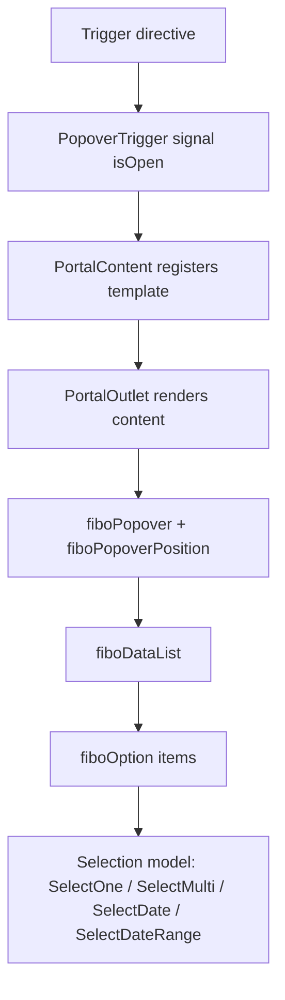

# Композиции и сценарии использования

Документ фиксирует реальные паттерны из `src/app/pages` и `src/app/app.html`.

## 1. Root shell паттерн

В приложении обязательно рендерить root-контейнеры overlays и portal:

```html
<fibo-tooltip-container></fibo-tooltip-container>
<fibo-dialog></fibo-dialog>
<fibo-drawer></fibo-drawer>
<fibo-confirmation></fibo-confirmation>
<fibo-notification></fibo-notification>
<fibo-portal-outlet></fibo-portal-outlet>
```

Это базовый orchestration-слой для всех портал/overlay сценариев.

## 2. Базовый popover + list selection

## 2.1. Схема



## 2.2. Где используется

1. `src/app/pages/select/select-page.ts`
2. `src/app/pages/multiple/multiple-select-page.ts`
3. `src/app/pages/datepicker/datepicker.ts`
4. `src/app/pages/menu/menu-page.ts`
5. `src/app/pages/form-example-page/form-example-page.ts`
6. `src/app/pages/playground-page/playground-page.ts`

## 3. Dialog: service -> trigger -> root component

## 3.1. Цепочка

1. `DialogTrigger` (`[fiboDialogTrigger]`) получает `TemplateRef`.
2. По click вызывает `DialogService.open(template)`.
3. `DialogService.content` становится non-null.
4. `FiboDialog` (в root) рендерит контент.
5. backdrop/close вызывает `DialogService.close()`.

## 3.2. Где смотреть

1. `projects/fibo-ui/components/src/lib/overlay/dialog/dialog-trigger.ts`
2. `projects/fibo-ui/components/src/lib/overlay/dialog/dialog-service.ts`
3. `projects/fibo-ui/components/src/lib/overlay/dialog/dialog.ts`
4. `src/app/pages/dialog-page/dialog-page.ts`

## 4. Drawer: service -> trigger -> root component

Цепочка полностью аналогична dialog:

1. `DrawerTrigger` -> `DrawerService.open(template)`.
2. `FiboDrawer` в root читает `DrawerService.content`.
3. backdrop/close -> `DrawerService.close()`.

Где смотреть:

1. `projects/fibo-ui/components/src/lib/overlay/drawer/drawer-trigger.ts`
2. `projects/fibo-ui/components/src/lib/overlay/drawer/drawer-service.ts`
3. `projects/fibo-ui/components/src/lib/overlay/drawer/drawer.ts`
4. `src/app/pages/drawer-page/drawer-page.ts`

## 5. Confirmation: directive event bridge + service state

## 5.1. Цепочка

1. На кнопке стоит `[confirm]` (`ConfirmationTrigger`).
2. Trigger открывает `ConfirmationService` с `onConfirm` callback.
3. `FiboConfirmation` рендерит дефолтный или кастомный контент.
4. `confirmation.confirm()` вызывает callback и закрывает модал.
5. callback пробрасывается наружу как output `(confirm)`.

## 5.2. Где смотреть

1. `projects/fibo-ui/components/src/lib/overlay/confirmation/confirmation-trigger.ts`
2. `projects/fibo-ui/components/src/lib/overlay/confirmation/confirmation-service.ts`
3. `projects/fibo-ui/components/src/lib/overlay/confirmation/confirmation.ts`
4. `src/app/pages/confirmation-page/confirmation-page.ts`

## 6. Notification: imperative service + passive renderer

## 6.1. Цепочка

1. Компонент вызывает `Notifier.success/info/warning/error/push`.
2. `Notifier` обновляет `notifications` signal.
3. `Notification` root компонент отображает список тостов.
4. Auto-close работает через таймеры в сервисе.

## 6.2. Где смотреть

1. `projects/fibo-ui/components/src/lib/overlay/notification/notifier.ts`
2. `projects/fibo-ui/components/src/lib/overlay/notification/notification.ts`
3. `src/app/pages/notification-page/notification-page.ts`

## 7. Tooltip: directive trigger + service + floating container

## 7.1. Цепочка

1. `[fiboTooltip]` на элементе вызывает `TooltipService.open(...)` при `mouseenter`.
2. `TooltipService.tooltipRef` хранит content/reference/placement.
3. `TooltipContainer` в root рендерит UI и позиционируется через CDK `fiboPopoverPosition` + `PopoverArrow`.
4. `mouseleave` вызывает `TooltipService.close()` с delay.

## 7.2. Где смотреть

1. `projects/fibo-ui/components/src/lib/overlay/tooltip/tooltip.ts`
2. `projects/fibo-ui/components/src/lib/overlay/tooltip/tooltip-service.ts`
3. `projects/fibo-ui/components/src/lib/overlay/tooltip/tooltip-container.ts`
4. `src/app/pages/tooltip/tooltip-page.ts`

## 8. Select/Datepicker as composition templates

## 8.1. Single Select template

1. field container (`FormFieldControl` или `fiboFormFieldTrigger`)
2. `*fiboPortalContent="let trigger"`
3. popover container: `fiboPopover [trigger] [matchWidth]`
4. list behavior: `fiboDataList`
5. selection model: `fiboSelectOne`
6. options: `fiboOption`

## 8.2. Multi Select template

Разница: `fiboSelectMulti`, chips + remove callbacks, checkbox в item-template.

## 8.3. Datepicker template

Разница: внутри поповера рендерится `<fibo-calendar>` и модель выбора даты (`fiboSelectDate` / `fiboSelectDateRange`).

## 9. Menu patterns

## 9.1. Базовое меню

- `fiboPopoverTriggerToggle` + `<fibo-menu [trigger]>` + projected `fiboMenuItem`.

## 9.2. Каскадное меню

- `PopoverMenu` + `MenuPanel` + internal `PopoverSubmenuTrigger` + nested portal content.

## 9.3. Value-selection menu

- `fibo-menu` может быть data-list и работать с `fiboSelectOne` для выбора значения.

## 10. Table pattern

## 10.1. Схема

1. `fibo-table` получает `dataSource`.
2. Колонки задаются через `*fiboColumn` templates.
3. Сортировка включается `fiboColumnIsSortable`.
4. Multi-select включается, если на table навешан `fiboSelectMulti`.

## 10.2. Где смотреть

1. `projects/fibo-ui/components/src/lib/table/table.ts`
2. `src/app/pages/grids/table-page/table-page.ts`

## 11. Form patterns

## 11.1. Low-level (CDK-first)

- `fiboFormField` / `fiboFormFieldTrigger` + native input + CDK primitives.
- Пример: `src/app/pages/form-example-page/form-example-page.ts`.

## 11.2. High-level (Components-first)

- `fibo-text-field`, `fibo-select`, `fibo-multi-select`, `fibo-datepicker` c `[formField]`.
- Пример: `src/app/pages/components-fields-form/components-fields-form.ts`.

## 12. Рекомендуемый порядок выбора подхода

1. Для продуктового кода: сначала готовые компоненты (`@fibo-ui/components`).
2. Для кастомного UI/behavior: CDK композиции (`@fibo-ui/cdk`).
3. Для сложных overlay/navigation сценариев: следовать root-shell паттерну и не пропускать `fibo-portal-outlet`.
