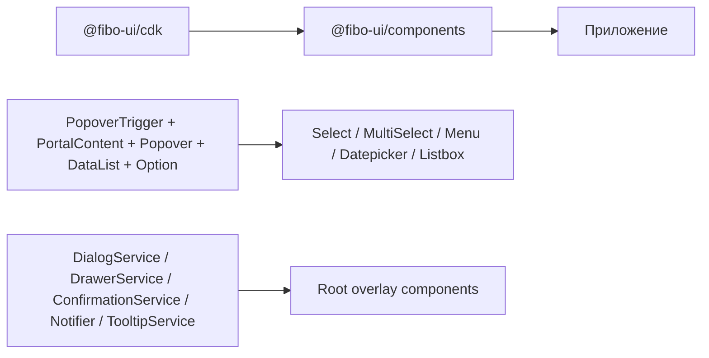

# Fibo UI Kit: обзор и концепция

## 1. Что это за библиотека

`fibo-ui` — это двухслойный Angular UI-kit:

1. `@fibo-ui/cdk`: headless-примитивы поведения (popover, portal, data-list, selection model, form-state bindings, date primitives, table directives).
2. `@fibo-ui/components`: готовые визуальные компоненты, собранные поверх CDK.

Ключевая идея: **сначала behavior/state (CDK), потом visual composition (Components)**.

## 2. Цели дизайна библиотеки

1. Максимально переиспользуемые директивы на сигналах (`input/model/output/computed/signal`).
2. Явная композиция через host directives вместо скрытой магии.
3. Унифицированный паттерн overlay-компонентов через сервис состояния + root-компонент-контейнер.
4. Совместимость с `@angular/forms/signals` через `FormValueControl` / `FormCheckboxControl`.
5. Tailwind + CSS токены темы (`@fibo-ui/components/theme`, `buttons`, `components`, `form-fields.css`).

## 3. Минимальная схема зависимостей



## 4. Что обязательно подключить в приложении

## 4.1. Стили

```css
@import '@fibo-ui/components/theme';
@import '@fibo-ui/components/buttons';
@import '@fibo-ui/components/components';
@import '@fibo-ui/components/src/form-fields.css';
```

## 4.2. Root-контейнеры overlays/portals

В корневом шаблоне приложения должны присутствовать:

1. `<fibo-tooltip-container>`
2. `<fibo-dialog>`
3. `<fibo-drawer>`
4. `<fibo-confirmation>`
5. `<fibo-notification>`
6. `<fibo-portal-outlet>`

Именно так это организовано в `src/app/app.html`.

## 4.3. Иконки

Компоненты используют `lucide-angular`; нужные иконки должны быть зарегистрированы в приложении.

## 5. Базовые архитектурные паттерны

## 5.1. Popover + Portal + DataList (базовая формула)

Почти все dropdown/popup-сценарии строятся по одной схеме:

1. Триггер (`fiboPopoverTriggerClick` / `fiboPopoverTriggerToggle` / `fiboFormFieldTrigger`).
2. Портал-контент (`*fiboPortalContent="let trigger"`).
3. Контейнер поповера (`fiboPopover [trigger]`).
4. Навигация по списку (`fiboDataList`).
5. Модель выбора (`fiboSelectOne` / `fiboSelectMulti` / `fiboSelectDate` / `fiboSelectDateRange`).
6. Элемент списка (`fiboOption`).

## 5.2. Overlay через service state

Для modal/drawer/confirmation/notification/tooltip используется единый подход:

1. Сервис хранит `signal` состояния.
2. Root-компонент подписан на сервис и рендерит UI.
3. Триггер-директивы/методы сервиса меняют состояние.

## 5.3. Form controls через signal forms

`TextField`, `DatePickerField`, `Select`, `MultiSelect`, `Checkbox`, `Switch` реализуют signal-form контракт (`FormValueControl`/`FormCheckboxControl`) и могут использоваться с `[formField]`.

## 6. Каталог публичного API (кратко)

## 6.1. `@fibo-ui/cdk`

1. Common: `IsEmptyPipe`, `RandomId`.
2. Form: `FormErrorService`, `FormErrorPipe`, `FirstFormErrorPipe`, `HasFormErrorPipe`, `FiboInput`, `FormFieldDirective`, `FormFieldTrigger`.
3. Data list: `DataList`, `Option`, `SelectOne`, `SelectMulti`, `SelectionModel`, `SELECTION_MODEL`.
4. Table primitives: `FiboColumn`, `FiboColumnHeader`, `FiboTableRow`.
5. Popover: `PopoverTrigger`, `PopoverTriggerClick`, `PopoverTriggerToggle`, `PopoverPosition`, `PopoverArrow`, `Popover`.
6. Date primitives: `DateAdapter`, `DateFnsDateAdapter`, `DATE_ADAPTER`, `SelectDate`, `SelectDateRange`.
7. Portal: `PortalRegistry`, `PortalContent`, `PortalOutletComponent`.
8. Utils: `safeProp`.

## 6.2. `@fibo-ui/components`

1. Form controls: `TextField`, `DatePickerField`, `FormFieldControl`, `Select`, `MultiSelect`, `Checkbox`, `Switch`, `Calendar`.
2. Overlay: `FiboDialog`, `DialogService`, `DialogTrigger`, `FiboDrawer`, `DrawerService`, `DrawerTrigger`, `FiboConfirmation`, `ConfirmationService`, `ConfirmationTrigger`, `Notification`, `Notifier`, `Tooltip`, `TooltipService`, `TooltipContainer`.
3. Navigation/menu: `PopoverMenu`, `MenuItem`, `MenuPanel`, `TreeMenu`, `TreeMenuChain`, `SideMenuGroup`, `SideMenuItem`, `MenuItemType`.
4. Data display: `Listbox`, `Table`, `LoadingSpin`.

## 7. Внутренние (неэкспортируемые) строительные блоки

Эти сущности используются внутри библиотеки и важны для сопровождения, но не являются публичным API пакета:

1. `PopoverSubmenuTrigger`
2. `CollapseSubmenuItem`
3. `ActiveMonth`
4. `CalendarCell` (заготовка)

## 8. Реальные примеры в приложении

`src/app/pages` содержит рабочие композиции и should-be-canonical usage:

1. `select-page.ts`, `multiple-select-page.ts` — CDK-only формулы select.
2. `datepicker.ts` — `Calendar` + `SelectDate`/`SelectDateRange`.
3. `menu-page.ts` — базовое/каскадное/value-меню.
4. `dialog-page.ts`, `drawer-page.ts`, `confirmation-page.ts`, `notification-page.ts`.
5. `components-fields-form.ts` — форма целиком на готовых компонентах.
6. `form-example-page.ts` и `playground-page.ts` — продвинутые композиции CDK.

## 9. Ограничения и важные замечания

1. Для `tooltip` и всех портальных попапов нужен `<fibo-portal-outlet>`.
2. `ConfirmationTrigger` имеет selector `[confirm]`, а контент задается через input alias `fiboConfirmationContent`.
3. `FormFieldDirective` использует часть state-свойств через `any` cast (`touched`, `readonly`) из signal forms API.
4. `Table` поддерживает сортировку и header multi-select только при подключении `fiboSelectMulti`.

## 10. Что читать дальше

1. Детальный CDK API: `docs/ui-kit-cdk-reference.md`.
2. Детальный Components API: `docs/ui-kit-components-reference.md`.
3. Композиции service→component→directive: `docs/ui-kit-composition-patterns.md`.
